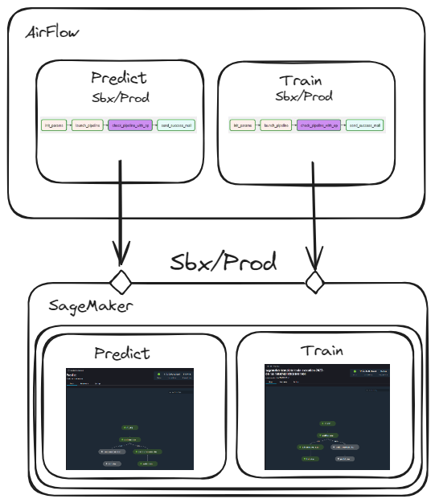
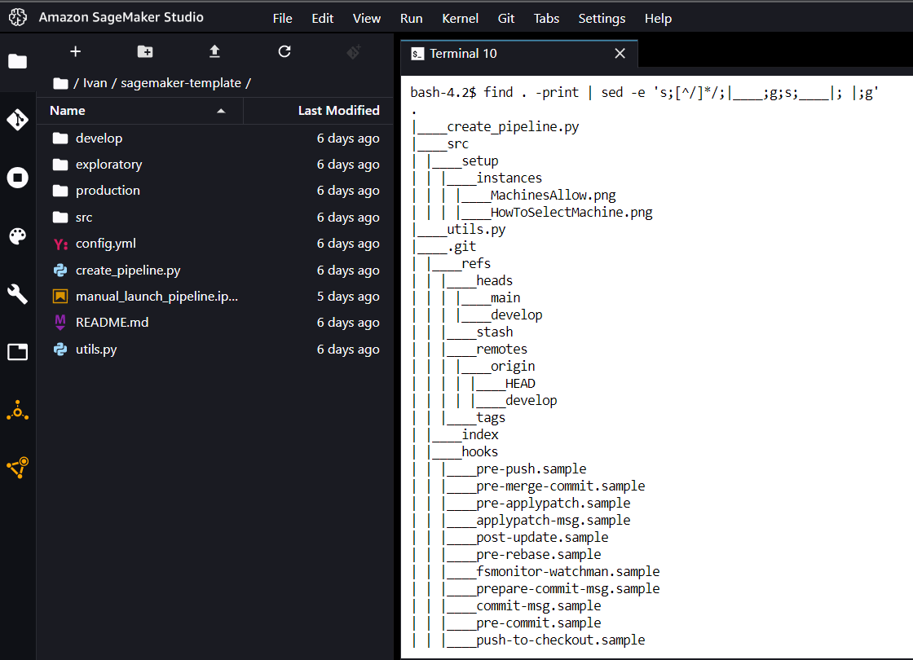
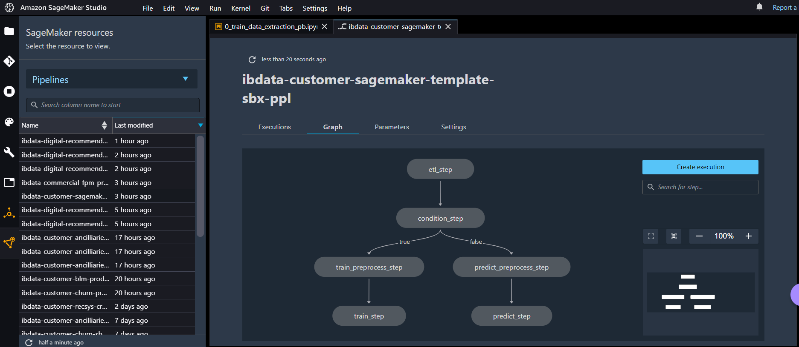
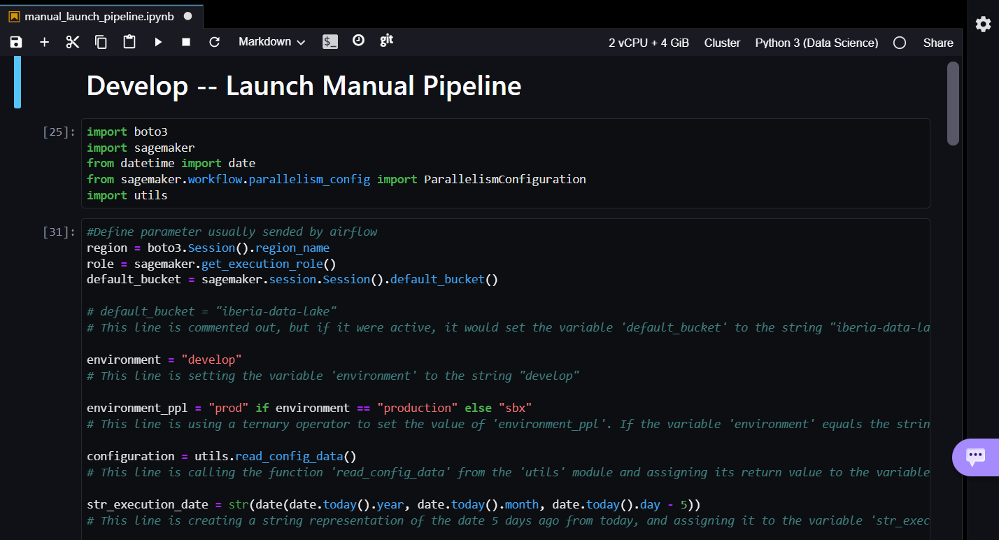
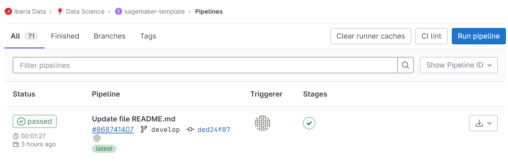
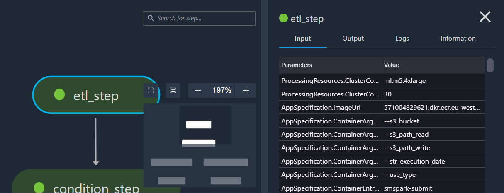

# Machine Learning Project - Sagemaker

#### Table of contents
[[_TOC_]]


## 1. Introduction



This repository has been created to guide data teams in using AWS SageMaker to develop and deploy Machine Learning models in production in an efficient manner. It provides a comprehensive guide, from an overview of the framework to using the adapted Jupyter notebook and deploying models in production using pipelines. It's important to note that this template serves as a guide, and teams are free to use different project structures and guidelines as per their requirements.

Amazon SageMaker is a fully managed service that assists developers and data engineers in building, training, and deploying high-quality machine learning models. It offers a variety of tools and resources for easy integration of AI solutions into applications and systems. SageMaker offers cloud-based machine learning tools for data preparation, model building, training, and deployment. It also provides pre-trained machine learning models, integrates with other AWS services, and offers model lifecycle management tools, thereby providing scalability, security, and reliability of the AWS cloud platform.

In addition to technical capabilities, SageMaker offers extensive documentation, tutorials, and support resources to assist developers of varying experience levels. It is cost-effective, allowing companies to pay only for the resources used and scale resources based on workload. With built-in security features, it ensures data and model protection. SageMaker is continually evolving, adding new features and capabilities regularly, ensuring that developers have access to the latest machine learning tools and technologies. Consequently, it stands as a compelling choice for companies looking to implement AI solutions into their systems and applications.

### Fast Launch Guide

**Step 1: Clone the Repository**

To begin with, you need to clone the repository containing the SageMaker template. You can do this by using the `git clone` command followed by the URL of the repository. Here is the command you should run:

```bash
git clone https://gitlab.com/iberia-data/data-science/sagemaker-template.git
```

This command will create a local copy of the repository on your machine. The repository contains the SageMaker template that you will be working with. Make sure you have Git installed on your machine to execute this command.

**Step 2: Edit Configuration Files**

Next, you will need to customize certain files to tailor the pipeline to your specific project. You need to change the pipeline's name in the following files: `gitlabci.yml` and `config.yml`. Here's how to do it:

1. **Editing `gitlabci.yml`:**

   Open the `gitlabci.yml` file in your preferred text editor. This file is the configuration file for GitLab CI/CD. Look for the place where the pipeline name is defined, and replace it with your new pipeline name. Save and close the file.

2. **Editing `config.yml`:**

   Similarly, open the `config.yml` file in your preferred text editor. This file is the configuration file for your SageMaker project. Change the pipeline name as needed, save, and close the file.

Remember to choose a pipeline name that is descriptive and meaningful, helping you and your team to understand the purpose of the pipeline at a glance.

**Step 3: Develop Generic Machine Learning Steps**

Now, you should focus on developing the generic steps of a machine learning model within the `develop` folder. These steps typically include data collection, data preprocessing, model development, model training, model evaluation, and model deployment. Here's a rough idea of how you could structure your code:

1. **Data Collection**

   You'll need scripts or notebooks for loading or downloading your data. This might involve connecting to a database, making API requests, or loading files from a cloud storage bucket.

2. **Data Preprocessing**

   This is where you'll clean and format your data so it's ready for your machine learning model. This could involve handling missing or inconsistent data, encoding categorical variables, normalizing numerical data, and splitting the data into training and test sets.

3. **Model Development**

   Define the architecture of your machine learning model. This could be a pre-defined model provided by a library like scikit-learn or PyTorch, or a custom model that you've designed yourself.

4. **Model Training**

   Write scripts or notebooks that will use your training data to teach your model to make accurate predictions. This typically involves repeatedly running your model on your data and adjusting the model's parameters based on its performance.

5. **Model Evaluation**

   After your model has been trained, you'll need to evaluate its performance. This usually involves running your model on your test data and comparing its predictions to the actual outcomes.

6. **Model Deployment**

   Finally, you'll want to write scripts that allow you to deploy your trained model. This could involve saving your model to a file, setting up a web server that can make predictions using your model, or configuring a cloud-based deployment using a service like AWS SageMaker.

Remember to keep your code modular and well-documented. Each step of the process should be clearly defined and easy for other developers to understand and modify.

**Step 4: Move the Code to the Corresponding .py Files**

It's important to organize your code properly for production. Python code is often moved from notebooks into .py files for this purpose. This makes the code easier to version control, test, and deploy. Here is how you might do it:

1. **Create .py Files**: 

   You should create separate .py files for each major step in your machine learning pipeline. For example, you could have `data_collection.py`, `data_preprocessing.py`, `model_development.py`, `model_training.py`, `model_evaluation.py`, and `model_deployment.py`.

2. **Move the Code**: 

   Open each .py file in your preferred text editor and paste in the relevant code from your notebooks. Ensure that the code is properly formatted and that all necessary imports are included at the top of the file. 

3. **Test the Scripts**:

   After moving your code, you should run each .py file individually to ensure that they work as expected. 

4. **Document the Code**:

   Add comments and docstrings to your .py files to explain what each part of the code does. This will make it easier for others to understand your code and contribute to it.

Remember to keep your functions small and focused on a single task. This makes your code easier to understand and test. Also, make sure you follow the Python style guidelines (PEP 8) to ensure your code is clean and consistent.

**Step 5: Generate requirements.txt for Each .py File**

Having a `requirements.txt` file is important for reproducibility and ease of setup in any Python project. This file specifies what python packages are required to run the project. Here's how you can generate it:

1. **Identify Dependencies:**

   For each .py file, identify the external Python libraries that are used. You can find these in the import statements at the top of each file. For example, if your file imports pandas, numpy, and sklearn, then those are dependencies.

2. **Create requirements.txt:**

   In the root of your project, create a `requirements.txt` file. In this file, you should list all of the dependencies you identified.

   Here's an example of what this file might look like:

   ```
   pandas==1.2.3
   numpy==1.20.1
   scikit-learn==0.24.1
   ```

   The `==` followed by a version number is used to specify the exact version of the package to install. Specifying the version ensures that your code will run the same way no matter where or when it is run. If you don't know the version number or if it doesn't matter, you can just list the package name without the `==`.

3. **Generate requirements.txt Automatically (optional):**

   Alternatively, if you have a Python virtual environment setup where you have installed all necessary packages and tested your code, you can automatically generate a `requirements.txt` file using `pip freeze > requirements.txt`. This command will output a list of all installed libraries and their respective versions in your virtual environment to a `requirements.txt` file.

Once your `requirements.txt` file is created, anyone can set up the necessary environment for your code to run by using the command `pip install -r requirements.txt`.

**Step 6: Edit the pipeline.py to Orchestrate the Different .py Files**

In your `pipeline.py` file, you'll need to import the relevant functions from each of your .py files. Ensure each .py file has a main function that can be called from `pipeline.py`.

Next, you'll need to create a main function within `pipeline.py` that calls each of the functions you've imported in the correct order of the Machine Learning workflow. 

The order typically will be:

1. Data Collection
2. Data Preprocessing
3. Model Development
4. Model Training
5. Model Evaluation
6. Model Deployment

Ensure that the output and input of each function are properly handled. For instance, the data collection function might return a DataFrame that's passed as an argument to the data preprocessing function.

**Step 7: Edit DAG to Orchestrate the Different Pipelines Using Airflow**

In this step, you'll be leveraging Apache Airflow, an open-source platform used to programmatically author, schedule, and monitor workflows. Airflow uses Directed Acyclic Graphs (DAGs) to manage workflow orchestration. A DAG is a collection of all the tasks you want to run, organized in a way that reflects their relationships and dependencies.

You'll need to create or edit a DAG file to orchestrate your pipelines. In this file, you'll define the execution order of your pipelines and set any dependencies between them. Here are the general steps to follow:

1. **Import Necessary Libraries**

   You'll need to import the necessary libraries to create your DAG. These typically include `DAG` and `PythonOperator` from the `airflow` library, as well as the functions from your pipelines.

2. **Define Default Arguments**

   Define the default arguments for your DAG, such as the `owner`, `start_date`, and any default email settings for task failure notifications.

3. **Instantiate a DAG**

   You'll create a new DAG instance, where you'll specify the `dag_id`, `default_args`, and `schedule_interval` among other parameters.

4. **Define Tasks**

   For each pipeline, you'll define a task. Each task is an instance of an operator class (like `PythonOperator`). In the task, you'll specify the function to execute (which would be the main function from each pipeline) and provide a task id.

5. **Set Task Dependencies**

   If there are dependencies between tasks, set them using the bitshift operators `<<` and `>>` (or the `set_upstream` and `set_downstream` methods).

Once your DAG is defined, you can place it in the `dags` directory of your Airflow installation. After doing so, Airflow will automatically pick it up, and it will appear in the Airflow UI where you can switch it on/off, monitor it, and trigger runs manually.

**Step 8: Remove All Instances of "Customer" from the Codebase**

The provided template was developed specifically for a "Customer" vertical. However, as you're adapting this template for a different purpose, it's essential to remove all instances of the word "Customer" throughout your code and replace them with terminology that suits your specific project or context.

Here are the main steps to follow:

1. **Scan Your Codebase**

   Thoroughly review your entire codebase, including all .py files, configuration files, and even file names for any instances of the word "Customer". Don't forget to also check comments, docstrings, and variable/function names.

2. **Replace "Customer"**

   When you find an instance of the word "Customer", replace it with the appropriate term for your project. Be careful to maintain the correct capitalization and ensure the replacement term makes sense in each context.

3. **Check Your Changes**

   After you've replaced all instances of "Customer", review your changes to ensure everything still makes sense and functions correctly. Test your code to make sure no errors were introduced during this process.

4. **Documentation and Commit Messages**

   Also, remember to update your project documentation and any related resources to reflect this change. When you commit these changes, include a clear and concise commit message such as "Replaced all instances of 'Customer' with 'NewTerm'" to maintain good version control practices.

Remember, consistency and clarity in naming conventions are important in software development. It can significantly improve the readability of your code and make it easier for others (and future you) to understand and maintain the project.


## 2. Sagemaker overview

### How does it work?


Let’s first understand how Jupyter notebooks are set up and accessed. Jupyter notebooks are by default hosted on a single machine and can be accessed via any web browser. The following diagram illustrates how it works if set up on an Amazon Elastic Compute Cloud (Amazon EC2 instance).

You can access the Jupyter notebooks by opening the browser and entering the URL of the Jupyter server, which makes an HTTPS/WSS call to the machine where the Jupyter server is hosted. The machine runs a notebook server that receives the request and uses zeromq to communicate with the kernel process.

As commented before, each user has his own EBS volume to store his data, the only thing that is shared is the instance where the notebook server is located between different verticals.

### Setup


The interface prior to using Sagemaker is shown below. Here are all the users, where the name nomenclature refers to the vertical, followed by a hyphen with the user's name. Each user has its own filesystem and shares with the other users the EC2 instance explained above to launch Sagemaker Studio. If we want to launch Sagemaker Studio with our user, we simply click on Launch and then Studio. It is important not to use the Canvas or TensorBoard service as it is quite expensive.

### Framework

In the picture above you can see the main Sagemaker interface. We have marked with numbers what we think is most important on a day-to-day basis and we will describe each of the points below:


1. Filesystem in Elastic Block Storage (EBS) where all data accessible by Sagemaker instances or notebook will be stored. It is recommended to store code, small files and configuration files here. For large files it is recommended to use s3.

2. In this tab will appear the instances that are active, the apps running in these instances, the kernels and the open terminals. It is important to look at it from time to time to avoid unnecessary expenses and to use the shutdown button in case you want to delete it.

3. To clone repositories or start a new one. In general, it is recommended to work with gitlab, although other types of project repositories can be used. To clone a repository it is recommended to use the terminal and to do it by means of commands

4. This tab is used for help, extensions or themes. It is rarely used.

5. Summary of Sagemaker internal tabs in use or open.

6. To initialize a jump start, i.e. a guided machine learning project. Its use has not been investigated.

7. Summary of the different projects, clusters and other active services in Sagemaker. Above all, it will be used to monitor and check the status of the pipelines.

8. Create a new launcher

9. Create a new folder

10. Import an external file from your local server

11. Update filesystem information and view

12. Using gitlab (command line recommended)

13. To create a new instance of jupyter notebook in the directory you are in

14. To create and use a console with python3

15. Used as a terminal image of the main Sagemaker instance.

16. Used as a system terminal of the main Sagemaker instance

17. To create a .txt file

18. We have never used it, but it is used to create less ad-hoc and more guided machine learning projects, with less flexibility.

### Terminal

There are a number of commands (apart from the typical bash commands) that will make your life easier when moving around in sagemaker:

- delete-pipeline: if you want to delete a pipeline already created, with this command you can delete it, but only if it belongs to your vertical.

- list-apps: in case you want to see the applications currently in use, this is a good option.

- update-pipeline: in case you want to update a pipeline already created.

- update-pipeline-execution: if you want to update an execution of a pipeline already created.



### Gitlab

GitLab is an important tool used alongside SageMaker for version control and collaboration. It is a web-based DevOps lifecycle tool that provides a Git repository manager providing a wiki, issue-tracking, and CI/CD pipeline features.

#### Usage with SageMaker

In a typical workflow, your codebase resides in GitLab repositories. You can clone these repositories to your SageMaker environment, work on your models, experiment, and then push your changes back to GitLab.

To clone a repository into your SageMaker environment, you'd typically use the terminal within SageMaker. Here are the steps:

- Open a terminal in SageMaker.
- Navigate to the directory where you want to clone the repository.
- Run the command: git clone [repository_url]
- After making changes to your code or notebooks, you would want to commit these changes and push them back to GitLab. Here's how you do it:

    - Open a terminal in SageMaker.
    - Navigate to the directory containing the cloned repository.
    - Run the command: git add . to stage all changes.
    - Run the command: git commit -m "Your commit message" to commit the changes.
    - Finally, run the command: git push to push your changes to the GitLab repository.

#### Note

It is recommended to work with GitLab primarily due to its seamless integration with SageMaker and other AWS services. However, it is important to note that other version control systems can be used as well, depending on your specific project needs and requirements.

### Pipeline

In the context of Amazon SageMaker, a pipeline represents a series of machine learning (ML) steps, such as data preparation, model training, model evaluation, and deployment. Each of these steps is encapsulated as a job. Pipelines bring an order of execution to these jobs, facilitating the process of building, training, and deploying a model.,



#### Creating a Pipeline

Creating a pipeline in SageMaker involves defining the steps that your machine learning workflow will go through. This could include:

- Data processing: Cleaning and transforming raw data into a format suitable for model training.

- Model training: Setting up and running a training job with your chosen algorithm and training data.

- Model evaluation: Evaluating the model's performance using a validation dataset.

- Model deployment: Deploying the trained model to an endpoint for making predictions.

Each step in the pipeline corresponds to a job that is defined using SageMaker's Python SDK. Once the pipeline is defined, it can be executed with a single command.

#### Updating a Pipeline

Once a pipeline has been created, you might need to update it to reflect changes in the workflow. For instance, you might want to use a different preprocessing method, or you might want to experiment with different training algorithms.

To update a pipeline, you can use the update-pipeline command. This allows you to change the pipeline definition and apply the changes without having to recreate the entire pipeline.

#### Deleting a Pipeline

If you no longer need a pipeline, you can delete it to clean up your SageMaker environment. This is done using the delete-pipeline command. Note that this will only delete the pipeline; any models trained by the pipeline will not be deleted.

#### Executing a Pipeline

To execute a pipeline, you can use the start-pipeline-execution command. This will run each step in the pipeline in the order they are defined.

If you want to update an execution of a pipeline that is already created, you can use the update-pipeline-execution command.

#### Monitoring a Pipeline

You can monitor the status of your pipelines through the SageMaker interface. This provides visibility into the progress of your pipeline execution and helps you identify any issues that might occur during the execution.

#### Debugging a Pipeline

In the event that a pipeline execution fails or produces unexpected results, SageMaker provides tools for debugging. Logs for each pipeline step are accessible through the AWS CloudWatch service, where you can examine detailed logs for each job in the pipeline. These logs can provide valuable insight into issues such as errors in your code or problems with data.

#### Pipeline Best Practices

- Modularity: Define each step in your pipeline as a separate, self-contained unit of work. This improves readability and makes it easier to update or replace individual steps.

- Version Control: Use a version control system such as GitLab to track changes to your pipeline definitions. This enables you to experiment with different configurations and roll back to a previous version if needed.

- Resource Management: Regularly review your active pipelines and delete any that are no longer needed. This helps manage resource usage and control costs.

- Security: Ensure that your pipelines are secure. Restrict access to your pipelines to only those who need it, use IAM roles to manage permissions, and encrypt sensitive data.

#### Pipeline and SageMaker Studio

SageMaker Studio provides a visual interface for creating and managing pipelines. You can drag and drop steps to create a pipeline, and then monitor the execution of each step in real-time. Additionally, you can view the code that defines each step, making it easier to understand what's happening at each stage of your machine learning workflow.

In summary, SageMaker pipelines are a powerful tool for orchestrating your machine learning workflows. They help you automate and standardize processes, improve collaboration, and increase the efficiency and reproducibility of your projects. By understanding how to create, update, and manage pipelines, you can take full advantage of the capabilities that SageMaker provides.

### Filesystem

The file system in Amazon SageMaker represents the structure and location of data files used in your machine learning workflows. This is typically managed using Amazon Elastic Block Store (EBS), a high-performance block storage service designed for use with Amazon EC2 for both throughput and transaction-intensive workloads at any scale.

#### Using EBS with SageMaker

Amazon EBS provides raw block-level storage that can be attached to Amazon EC2 instances, and is used in Amazon SageMaker to provide storage for your Jupyter notebooks, data files, and other important files. This allows the data to be easily accessible by your SageMaker instances or notebooks.

Storing code and small files: It is recommended to store your code files, small datasets, and configuration files in EBS. These files can be quickly accessed and used in your SageMaker notebooks.

Updating filesystem information and viewing: You can view and update your file system directly from your SageMaker notebook instance. This provides an easy way to manage your files and directories.

#### Using S3 for Large Files

For larger files and datasets, it is recommended to use Amazon S3 (Simple Storage Service), an object storage service that offers industry-leading scalability, data availability, security, and performance.

This means that you can store and retrieve any amount of data at any time, from anywhere on the web, and only pay for what you use. In your SageMaker environment, you can easily read data from S3 into your notebooks for analysis or model training, and write results or models back to S3.

#### Creating New Folders and Files

Within your SageMaker environment, you can create new directories to organize your files as you would in any other file system. Additionally, you can create new files such as .txt files or new instances of Jupyter notebooks directly within the directory you are in.

#### Importing External Files

To import external files from your local server, you can use the 'Upload' button in the SageMaker interface. This will allow you to select files from your local machine and upload them to your SageMaker environment.

In conclusion, the file system in SageMaker, along with EBS and S3, provides a robust and flexible structure for managing your data and code. Understanding how to effectively use these resources is essential for maintaining an organized and efficient workflow in your machine learning projects.

## 3. Sagemaker Notebooks [Jupyter]

Amazon SageMaker Notebook is a cloud-integrated Jupyter notebook service designed to simplify development and code execution on Amazon SageMaker. It enables developers and data scientists to create and run Jupyter notebooks in a secure, managed environment, with access to AWS resources and processing power.

SageMaker notebooks are based on Amazon Elastic Container Service (ECS) and run on dedicated instances. SageMaker manages the underlying infrastructure, which means users can focus on code and data, rather than worrying about infrastructure configuration.

SageMaker notebooks also offer seamless integration with other SageMaker features, such as data warehousing and training and deployment services. Users can access AWS resources, such as S3, EC2 and ECR, from within the notebook, allowing them to use AWS tools and services to build and train machine learning models and create comprehensive data analytics workflows.

In short, the AWS SageMaker notebook environment is a secure, managed cloud development platform for building, running and distributing machine learning and data analytics applications.



### Framework

The framework in Amazon SageMaker provides an integrated and scalable environment for handling all stages of a machine learning workflow - including data exploration, data cleaning, model training, model evaluation, and deployment.

#### Understanding the SageMaker Interface

The SageMaker interface is intuitive and user-friendly, designed to help you manage your machine learning projects efficiently. Here are some of the main components of the SageMaker interface:

- Instances: The instances tab shows all active instances, including the apps running on these instances, the kernels, and the open terminals. Regularly checking this tab will help avoid unnecessary expenses. You can shut down instances when they are no longer needed.

- Repositories: SageMaker provides the ability to clone repositories or start a new one. It is generally recommended to use GitLab for version control, but other repository services can also be used.

- Help and Extensions: This tab is used for accessing help resources, managing extensions, and changing themes.

- Internal Tabs: A summary of SageMaker internal tabs that are in use or open can be seen, allowing for easy navigation between different components of SageMaker.

- Jump Start: This option allows you to initialize a guided machine learning project.

- Projects and Services: This provides a summary of the different projects, clusters, and other active services in SageMaker. It is mainly used to monitor and check the status of the pipelines.

#### Creating New Resources

From the SageMaker interface, you can also perform actions such as creating a new launcher, a new folder, or importing an external file from your local server. You can also create new instances of Jupyter notebooks in the directory you are in or create and use a console with Python3.

#### Working with the Terminal

The terminal in SageMaker serves as a command-line interface where you can run a variety of commands to manage your SageMaker resources. Some of the commands you may frequently use include delete-pipeline, list-apps, update-pipeline, and update-pipeline-execution.

In conclusion, the SageMaker framework provides a comprehensive, user-friendly, and powerful platform for machine learning development. By understanding the various components and how they interact, you can leverage SageMaker to streamline your machine learning workflows and enhance productivity.

### Instances

AWS SageMaker offers several main instances that can be used depending on the use case. It is important to emphasize that due to infra limitations, not all of them can be used and in case of not being able to use it, an error will be displayed. The type instances are the following:

- ml.t2.medium: This is a low-cost instance that can be used for development and testing purposes.

- ml.m4.xlarge: This is a more powerful instance that can be used for training and intensive processing tasks. We recommend this instance for running processes with Pandas and for steps in production for both in-memory processing and training. If we want more capacity or memory, we simply increase the number (i.e. ml.m8.xlarge).

- ml.p2.xlarge: This is an instance designed for GPU processing tasks, such as training deep learning models.

- ml.g4dn.xlarge: This is a GPU instance designed for graphics-intensive tasks, such as data visualization and image generation.

- ml.c5.large: An instance designed for processing-intensive tasks that require high network bandwidth, such as large-scale data transfer.

Use case recommendation for each instance:

- ml.t2.medium: Ideal for testing and code development. We recommend this instance for launching processes in pyspark, as the instance is only used to connect to the EMR cluster and does not require high capacity and memory.

- ml.m4.xlarge: Ideal for model training and intensive processing.

- ml.p2.xlarge: Ideal for deep learning model training and other GPU processing tasks.

- ml.g4dn.xlarge: Ideal for data visualization and image generation.

- ml.c5.large: Ideal for large-scale data transfer and other processing-intensive tasks requiring high network bandwidth.

These are only general recommendations. The final use of each instance will depend on the specific use case and the performance and cost requirements. The choice of the appropriate instance depends on many factors, such as the size of the model, the size of the training data, the desired speed and efficiency, among others. It is important to carefully evaluate the needs and requirements before selecting an instance for use with Amazon SageMaker.

To select a machine, you must perform the following steps


Once selected, a menu will be displayed in which you can filter the machines that have quick access. It should be noted that the access times to any machine is affordable, being only a few minutes in most cases.


To check the prices associated with each of the machines that can be selected, you can go to the following address: https://aws.amazon.com/es/sagemaker/pricing/

### Memory/CPU based

In Amazon SageMaker, as in other cloud-based environments, resources such as memory and CPU play a crucial role in determining the performance of your machine learning workflows. Understanding how these resources are used and allocated can help you optimize your workflows and manage costs.

#### Memory in SageMaker

Memory is a critical resource for machine learning tasks, as these tasks often involve handling large amounts of data and require significant memory capacity. In SageMaker, the amount of memory available to you depends on the type of EC2 instance you choose for your notebook instances or training jobs. Amazon provides a wide variety of instance types with varying amounts of memory to cater to different requirements.

Large datasets or memory-intensive operations might require instances with a high memory capacity. SageMaker also allows for distributed training on multiple instances, effectively multiplying the available memory.

#### CPU in SageMaker

The Central Processing Unit (CPU) is responsible for executing the instructions of a computer program. In machine learning, CPUs are essential for data processing and model training, especially for tasks that can't be easily parallelized.

The number of CPU cores available in SageMaker depends on the EC2 instance type chosen. Some instance types come with powerful CPUs with multiple cores, which can speed up the training process significantly.

#### Choosing the Right Instance Type

Selecting the right instance type for your SageMaker tasks is a balance between performance and cost. High-memory and high-CPU instances provide better performance but come at a higher cost. You should consider the requirements of your specific tasks and datasets when selecting an instance type.

#### Monitoring Usage

SageMaker provides tools for monitoring the usage of memory and CPU resources. Regular monitoring can help you identify bottlenecks, understand the performance of your tasks, and make necessary adjustments.

##### Installing libraries

- Installation of libraries on a SageMaker Notebook machine:
- Open a terminal on the Jupyter notebook.
- Use the !pip install command to install the required libraries. For example, !pip install pandas matplotlib.

Note that some libraries, such as the data analysis libraries, may require more memory and processing power than is provided by default on a SageMaker Notebook machine. In these cases, it may be necessary to increase the memory and processing power of the machine before installing the libraries.

The following problems may be encountered when attempting to install libraries on SageMaker:

- Insufficient permissions: If the user does not have sufficient permissions to install libraries in the SageMaker environment, they may receive an error message indicating that they do not have permissions to install libraries.

- Dependency conflicts: Libraries often depend on other libraries to function properly. If a library depends on a specific version of another library, but the currently installed version is different, a dependency conflict may occur resulting in an error when installing the library.

- Internet connection problems: If the SageMaker environment does not have Internet access, it may not be able to download the required libraries during installation.

- Compatibility issues: Libraries are often developed to work with specific versions of Python and other technologies. If a library is not compatible with the version of Python or technology running in the SageMaker environment, an error may occur when attempting to install the library.

- Resource issues: Some libraries may require a large amount of resources to function properly. If the SageMaker environment does not have sufficient resources available, an error may occur when attempting to install the library.

These are some of the most common problems a user may encounter when trying to install libraries in SageMaker. To resolve these problems, it is important to investigate the error message, review the documentation and consult the user community.

Additionally, it is recommended to check for updates and compatibility with the latest versions of libraries and technologies before installing. It may also be helpful to use a virtual environment or container to isolate the installation of libraries from other projects.

Finally, to avoid potential issues with library installation in SageMaker, it is a best practice to document the libraries and their versions used in a project, and to save them in a requirements.txt file. This can help ensure that the same libraries and versions are used consistently across different environments and projects.

In summary, installing libraries in SageMaker can be a straightforward process using the !pip install command, but it is important to be aware of potential issues such as insufficient permissions, dependency conflicts, internet connection problems, compatibility issues, and resource issues. By understanding these issues and following best practices, developers can successfully install the required libraries and build high-quality machine learning models in SageMaker.

##### Tips

- Understand Your Resource Needs: Before starting a project, understand the memory, CPU, and storage requirements of your tasks. This will help you choose the right instance type and avoid unnecessary costs.

- Use the Right Tools for the Job: Use EBS for storing code and small files, and S3 for large datasets. Use SageMaker's built-in algorithms and models when possible to save time and effort.

- Leverage Built-in Capabilities: SageMaker comes with a range of built-in capabilities, such as automatic model tuning, distributed training, and managed endpoints. Make sure to leverage these features to streamline your machine learning workflows.

- Monitor Your Resources: Regularly monitor your resource usage to avoid unnecessary costs. Use CloudWatch to keep track of your instance performance and adjust as needed.

- Clean Up Unused Resources: Regularly review and delete unused resources, such as notebook instances, training jobs, and endpoints. This will help you avoid unnecessary costs.

- Use Version Control: Use a version control system like GitLab to manage your code. This allows you to track changes, collaborate with others, and revert back to previous versions if needed.

- Secure Your Work: Use AWS's security best practices to protect your data and models. This includes using IAM roles for access control, encrypting sensitive data, and regularly reviewing your security settings.

- Stay Updated: AWS regularly updates SageMaker with new features and improvements. Stay updated with the latest changes to make the most of your SageMaker environment.

- Use SageMaker Studio: SageMaker Studio provides a single, web-based visual interface where you can perform all ML development steps. It enhances productivity by enabling you to create, train, debug, deploy, and monitor all your machine learning models in a single place.

- Learn from Others: Make use of the extensive documentation, tutorials, and examples provided by AWS and the broader SageMaker community. These resources can provide valuable guidance and insights.

Remember, the goal is to leverage the full potential of SageMaker to create robust, efficient, and scalable machine learning solutions.

#### Distributed based [EMR]

##### Installing libraries

Installing libraries on an Apache Spark cluster and on a SageMaker Notebook machine is a different process, depending on how Spark is being used.

Installing libraries on a Spark cluster:

- Create a Python dependencies file, such as a requirements.txt file, containing the libraries you want to install.
- Upload the dependencies file to S3 or other Spark-accessible file storage.
- Start a Spark cluster on Amazon EMR, which will include an option to specify the location of the dependency file.
- Once the cluster is active, you can install the libraries on the cluster by using !pip install -r and providing the location of the dependency file in S3.

Another option available to the user is the use of the command "spark-submit --py-files."

This command allows you to submit your application to a Spark cluster and include Python .zip, .egg or .py files that contain your dependencies. Here's how to use it:

- Package your Python dependencies into .zip, .egg or .py files.
- Upload these files to a location accessible by your Spark cluster, such as S3.
- When you're ready to submit your job, use the `spark-submit --py-files` command and provide the location of your dependency files. The command might look something like this:

  ```
  spark-submit --py-files s3://my-bucket/my-dependencies.zip my_script.py
  ```

This will submit `my_script.py` to be run on the Spark cluster, and the Python dependencies inside `my-dependencies.zip` will be available to your script.

Installing libraries on a SageMaker Notebook machine:

- In a SageMaker Notebook, you can install libraries directly using `!pip install` command in a code cell. For example, to install the library `numpy`, you would use:

  ```python
  !pip install numpy
  ```

- If you have a requirements.txt file, you can install all the libraries listed in the file with:

  ```python
  !pip install -r requirements.txt
  ```

Please note that the libraries are installed for the current Jupyter kernel only. If you change the kernel, you will need to install the libraries again for that specific kernel.

##### SparkMagic

SparkMagic is a set of commands that allow users to run code on an Apache Spark cluster from within a Jupyter notebook. These commands are designed to facilitate the integration of Spark with Jupyter and provide a command line interface for interacting with Spark from the notebook.

With SparkMagic, users can run code in Spark from the notebook without having to leave the Jupyter interface. In addition, SparkMagic also allows users to visualize and explore the results of Spark commands on the notebook itself.

SparkMagic also provides seamless integration with other AWS tools and services, such as S3, EC2 and EMR. This means users can access data stored in S3 and process it with Spark, use EC2 to run the Spark cluster, and use EMR to manage the underlying infrastructure.

In short, SparkMagic commands provide a simple and efficient way to interact with Apache Spark from a Jupyter notebook, and also allow users to use AWS features and resources to process and analyze data in large volumes.

SparkMagic commands include the following:

`%spark configure`: This command allows users to configure the connection to a Spark cluster. Users can specify the cluster URL, port, user and password, among other details.

`%spark`: This command allows users to create a Spark session on the specified cluster using %spark configure. After creating the session, users can write and execute code in Spark directly from the notebook.

`%spark info`: This command displays information about the current Spark session, including the session ID, the cluster to which it is connected, and the session status.

`%spark log`: This command displays logs for the current Spark session. These logs can be useful for debugging errors and better understanding what is happening in the cluster.

`%spark cleanup`: This command closes the current Spark session and frees the resources associated with the session.

`%spark add`: This command allows users to add files to the current Spark session. Users can add local or remote files to the session so that they can be accessed and used by Spark.

`%spark load`: This command allows users to load data into Spark from a local or remote file.

`%spark display`: This command allows users to display the results of Spark commands on the notebook. The results are displayed in a user-friendly format, such as a table or a graph.

These are the main SparkMagic commands, and together they provide an efficient and easy way to interact with Spark from the Jupyter notebook.

##### Tips

Amazon EMR is a distributed data processing service that enables users to process large amounts of data using frameworks such as Apache Spark and Hadoop. Amazon SageMaker, on the other hand, is a fully managed service that helps developers create, train and deploy high-quality machine learning models. Here are some tips for using Amazon EMR from Amazon SageMaker:

Use Amazon EMR Notebooks - Amazon EMR Notebooks is a service that allows users to create and run Jupyter notebooks on an EMR cluster. This means you can run code in Spark or Hadoop on the same EMR cluster you are working on, which reduces latency and improves performance. In addition, you can create an EMR cluster directly from Amazon SageMaker and then connect to it from an EMR notebook.

Use EMR Studio: EMR Studio is a web development environment that enables users to create, develop and run big data-based applications. By using EMR Studio, users can connect directly to their EMR cluster and run code in Spark or Hadoop. EMR Studio is an ideal choice for those who prefer a graphical user interface instead of a command line.

Use the Boto3 SDK: The Boto3 SDK is a Python library that allows developers to interact with AWS services. Using the Boto3 SDK, users can connect to their EMR cluster and run code in Spark or Hadoop directly from Python. This is especially useful for those who prefer to write code in Python rather than Scala or Java.

Use SageMaker's integration with EMR: Amazon SageMaker integrates seamlessly with EMR, which means you can use EMR to preprocess your data before training your models in SageMaker. To use this integration, you need to create an EMR cluster and load your data into it. You can then use Spark or Hadoop to preprocess your data and store it in Amazon S3. Then, you can use SageMaker to train your models using the preprocessed data.

In summary, Amazon EMR and Amazon SageMaker are two powerful services that complement each other to enable users to process large amounts of data and train high-quality machine learning models. By using the tips above, you can take full advantage of these tools and improve the efficiency of your big data and machine learning workflows.

TODO: Meter tips mas especificos

### Plotting

In Amazon SageMaker, users can generate graphs and visualizations to explore and understand their training data and machine learning models. This can be done using different visualization tools and libraries, such as Matplotlib, Seaborn, Plotly, among others.

However, when generating charts in Amazon SageMaker, users may encounter some issues, such as:

Configuration of visualization packages: Ensuring that the packages needed to generate charts are installed and configured correctly in the Amazon SageMaker environment can be a challenge for some users.

Performance issues: Generating charts with large amounts of data can require a lot of processing resources and can cause performance issues in the Amazon SageMaker environment.

Display issues: Sometimes, generated charts may not look as expected due to formatting or configuration issues.

Therefore, it is important for users to be aware of these potential issues when generating charts in Amazon SageMaker and take steps to address them. This includes documenting and using the appropriate visualization tools and libraries, as well as optimizing processing resources and configuring the necessary packages correctly.

Depending on the tool or library you want to use, here are some examples:

Matplotlib: is an open source data visualization library that can be used to generate charts in Amazon SageMaker. You can import and use Matplotlib in an Amazon SageMaker notebook and use its functions to generate charts.

```
!pip install matplotlib
import matplotlib.pyplot as plt
import numpy as np

# We generate example data
data = [3, 4, 1, 1, 5, 2]

# Create bar chart
plt.bar(np.arange(len(data)), data)

# Show chart
plt.show()
```

This code first installs the Matplotlib package, then imports the library and creates a bar chart with example data. The plt.show() function displays the chart on the notebook.

Seaborn: is another open source data visualization library that can be used to generate charts in Amazon SageMaker. Seaborn provides an easy-to-use interface for creating complex charts using Matplotlib.

```
!pip install seaborn
import seaborn as sns
import matplotlib.pyplot as plt
import numpy as np

# We generate example data
data = np.random.rand(50, 2)

# Create scatterplot
sns.scatterplot(data[:, 0], data[:, 1])

# Show plot
plt.show()
```

This code first installs the Seaborn package, then imports the library and creates a scatterplot with sample data. The plt.show() function displays the plot on the notebook.

Plotly: is an open source interactive visualization library that can be used to generate charts in Amazon SageMaker. With Plotly, users can create interactive charts with a wide variety of features and styles.

```
!pip install plotly
import plotly.express as px
import pandas as pd

# We generate example data
data = {'Fruit': ['Apple', 'Banana', 'Cherry', 'Date'],
        'Count': [3, 4, 1, 5]}

# Create DataFrame
df = pd.DataFrame(data)

# Create bar chart
fig = px.bar(df, x='Fruit', y='Count')

# Show graph
fig.show()
```

This code first installs the Plotly package, then imports the library and creates a bar chart with example data in a Pandas DataFrame. The fig.show() function displays the chart in the notebook.

To use any of these tools or libraries, users must first install and configure the necessary packages in their Amazon SageMaker environment. Then, they can import the library into their notebook and use its functions to generate charts.

It is important to note that chart generation can require a lot of processing resources and can cause performance issues in the Amazon SageMaker environment, so it is important to optimize resources and properly configure the necessary packages.

### boto3 [s3]

Boto3 is a software library developed by Amazon Web Services (AWS) that provides an application programming interface (API) for interacting with different AWS services. Boto3 makes it easy to work with AWS services from Python.

In Sagemaker, Boto3 is used to manage and automate tasks related to the creation and use of machine learning models. For example, Boto3 can be used to create and manage Sagemaker resources, such as training and production instances, and to send and receive data to and from Sagemaker.

Boto3 is built on top of a library called Botocore, which it shares with AWS CLI. Botocore provides the low-level client, session, and credential and configuration data. Boto 3 builds on Botocore by providing its own session, resources, and collections.

Modules generally fall into two categories, those that include a high-level object-oriented interface and those that include only a low-level interface that matches the Amazon Web Services API (These interfaces are resources and clients respectively. a look at both shortly).
Some modules are completely high-level (such as Amazon S3 or EC2), some include high-level code over a low-level connection (such as Amazon DynamoDB), and some are 100% low-level (such as Amazon Elastic Transcoder).
Clients: are low-level service connections with the following main characteristics:

Supports all services.
Outputs are returned using Python dictionaries.
We have to traverse these dictionaries ourselves
Automatic pagination of responses (Paginators)
A way to block until a certain state has been reached (Waiters)

Along with these core features, Boto 3 also provides sessions and per-session credentials and configuration, as well as basic components such as authentication, parameter and response handling, an event system for customizations, and logic for retrying failed requests.

Some code examples of using Boto3 with Sagemaker are described below:

Read files present with pandas from S3:
```
import boto3

s3 = boto3.client('s3')

response = s3.list_objects(
    Bucket='my-bucket',
    Prefix='path/to/my/files/'
)

files = [content['Key'] for content in response.get('Contents', [])]

print(files)
```

Create a Sagemaker trainer:

```
import boto3

sagemaker = boto3.client('sagemaker')

training_image = '012345678910.dkr.ecr.us-west-2.amazonaws.com/image-classification:latest'
role = 'arn:aws:iam::012345678910:role/service-role/AmazonSageMaker-ExecutionRole-20181129T121160'

response = sagemaker.create_training_job(
    TrainingJobName='my-training-job',
    AlgorithmSpecification={
        'TrainingImage': training_image,
        'TrainingInputMode': 'File'
    },
    RoleArn=role,
    InputDataConfig=[
        {
            'ChannelName': 'train',
            'DataSource': {
                'S3DataSource': {
                    'S3DataType': 'S3Prefix',
                    'S3Uri': 's3://my-bucket/train',
                    { 'S3DataDistributionType': 'FullyReplicated'.
                }
            },
            'ContentType': 'application/x-record',
            'CompressionType': 'None'
        }
    ],
    OutputDataConfig={
        'S3OutputPath': 's3://my-bucket/output'
    },
    ResourceConfig={
        'InstanceType': 'ml.c4.xlarge',
        'InstanceCount': 1,
        'VolumeSizeInGB': 50
    },
    StoppingCondition={
        'MaxRuntimeInSeconds': 3600
    },
    HyperParameters={
        'image_shape': '3,224,224',
        'num_classes': '2',
        'num_training_samples': '15420',
        'mini_batch_size': '10',
        'epochs': '10',
        'learning_rate': '0.01'
    }
)

```
Create a Sagemaker endpoint:

```
import boto3

sagemaker = boto3.client('sagemaker')

response = sagemaker.create_endpoint(
    EndpointName='my-endpoint',
    EndpointConfigName='my-endpoint-config', EndpointConfigName='my-endpoint-config'.
)

print(response)
```
In this example, an endpoint with the name my-endpoint is created and associated with a previously created endpoint configuration named my-endpoint-config. The API response will include information about the created endpoint, such as the ID and the current status.

Note: Before creating an endpoint, you must first create an endpoint configuration that specifies details about how the model will be used in production.


## 4. Production

In the lifecycle of a data science project, the Production phase plays a crucial role. This stage signifies that the models and data processing pipelines developed throughout the project have been tested, validated, and are now ready for deployment in a real-world scenario. The purpose is to automate the process, ensuring that the project delivers actionable, timely, and accurate insights consistently.

During the production phase, code is refined and optimized, data pipelines are finalized, and models are set up for continuous learning. Strict version control is adhered to, and rigorous testing is done to ensure everything functions as expected when new data is encountered.

This section aims to provide a detailed overview of the project structure during the production phase, outlining the organization and purpose of different directories and files. It will offer a clear understanding of how the production environment is set up, enabling efficient navigation and modification as the project evolves. This knowledge is critical not only for the current team members but also for future contributors who may need to understand the system quickly.


### Project structure

- develop: This folder typically contains all the developmental codes and scripts. It can include various versions of data processing, model development, and testing codes that data scientists have worked on during the development stage.

- exploratory: This folder is often used for exploratory data analysis (EDA). It may contain notebooks or scripts which were used to initially understand and explore the data, find patterns, perform statistical analysis, and design initial models.

- production: This is the heart of the project where the final, production-ready code resides.

    - code: This folder contains the final version of all the scripts used in the project, including data processing, modeling, validation, and deployment scripts.
    - packages: This folder contains any additional packages or libraries that are used by the code. These can be custom packages developed specifically for the project, or third-party packages that aren't readily available.
    - pipelines_code: This folder contains code for the various data pipelines used in the project. These pipelines automate the process of data ingestion, cleaning, transformation, model training, validation, and prediction generation.

- src: Short for source, this directory is used for code that will be imported in your scripts. It often contains utility functions and classes, and is typically structured as a Python package containing init files. This is where the majority of the reusable code will be placed, like helper functions or custom classes that are used across the project.

Please note that this is a standard structure and can be customized according to the specific needs of the project.

#### Exploratory data analysis (EDA)

The Exploratory Data Analysis (EDA) phase is one of the most crucial stages in any data science project. It refers to the critical process of performing initial investigations on data to discover patterns, spot anomalies, test hypotheses, and check assumptions with the help of summary statistics and graphical representations.

Here is a deeper look at what the `exploratory` folder might contain:

- **Data Profiling Reports**: These are comprehensive reports generated using libraries like pandas-profiling in Python. They provide a thorough summary of the dataset, including the number of missing values, unique values, data types, common values, etc. This is often the first step in understanding the data.

- **Notebooks/Scripts for Data Visualization**: These files contain code for generating various visualizations that help understand the data better. They can include histograms, box plots, scatter plots, correlation heatmaps, etc. These visualizations aid in understanding the distribution of data, presence of outliers, and relationships between different variables.

- **Hypothesis Testing Results**: If any statistical hypothesis testing is done during the EDA, the results and the code used for testing will be present in this folder. This can help understand if certain assumptions about the data hold true.

- **Insights Reports**: After analyzing the data, the key findings and insights are often compiled into a report. This can be in the form of a markdown file or a Jupyter notebook. It helps anyone reading the report to understand the key takeaways from the EDA.

- **Preprocessing Code**: Any code used to clean the data, handle missing values, or perform feature engineering will be present in this folder. This code is often not the final version and may be subject to changes as the project progresses.

Remember, the contents of the `exploratory` folder can vary depending on the project's needs and the data scientist's preferences. The purpose of this folder is to provide a snapshot of the initial data understanding and exploration process.

#### Develop

The `develop` directory in a data science project plays a vital role in housing all developmental scripts and codes. It's a workspace where data scientists can experiment, test, and iterate on different solutions before finalizing the best approach. Here's a deeper look at what this section may contain:

- **Feature Experimentation**: Scripts or notebooks in this section can involve trying out different feature engineering techniques, testing different transformations, and creating new features. This is an experimental space where data scientists can freely modify and tweak features to see how these changes impact model performance.

- **Model Experimentation**: This section might contain multiple scripts or notebooks, each representing a different machine learning model or a different set of hyperparameters. The purpose is to test a variety of models and configurations to find the one that offers the best performance on the problem at hand.

- **Data Cleaning and Preprocessing**: While the final data cleaning and preprocessing steps would be in the production code, the `develop` folder might contain various versions of cleaning and preprocessing scripts, each representing a different approach to handling missing values, outliers, and other data issues.

- **Validation and Evaluation**: You might find scripts here that are used to validate the models on validation datasets and evaluate their performance using various metrics. These scripts help in comparing different models and choosing the best one for production.

- **Drafts and Old Versions**: The `develop` folder can also serve as an archive for older versions of scripts or drafts that were used at some point in the project but were later replaced or updated. 

Remember, the `develop` folder is a dynamic space that evolves over time as the project progresses. It allows data scientists to iterate on their work, improving the project's final outcomes, and providing a history of the thought process and progression of the project.

#### Production

The `production` folder is a crucial part of any data science project. It signifies the transition from development and testing to real-world application. This directory typically contains the final, refined versions of all code, scripts, and other files used in the project. Here's an in-depth look at what it might include:

- **Final Code**: This is the cleaned-up and optimized version of all the scripts used in the project, including data preprocessing, modeling, validation, and deployment scripts. The code here is ready for production and can handle new data efficiently.

- **Packages**: This directory contains any additional packages or libraries that are used by the code. These can be custom packages developed specifically for the project, or third-party packages that aren't readily available through standard package managers.

- **Model Files**: The `production` folder would also typically contain the final, trained versions of the machine learning models used in the project. These models are ready to be deployed and used for making predictions on new data.

- **Data Pipelines**: The production folder contains the finalized versions of data pipelines. These pipelines automate the process of data ingestion, cleaning, transformation, model training, validation, and prediction generation. They are designed to handle new data efficiently and reliably.

- **Configuration Files**: Any configuration files required to run the scripts or set up the environment would be part of the production folder. This includes files specifying the correct versions of libraries to use, paths to data or model files, and other configuration details.

- **Documentation**: Finally, the `production` folder should contain thorough documentation explaining how to use the scripts, what each part of the code does, how to set up and use the data pipelines, and how to deploy and use the models. This documentation is crucial for ensuring that the project can be used and maintained effectively in the future.

Remember, the `production` folder is the culmination of all the work done throughout the project. It should contain everything needed to deploy the project in a real-world environment and generate actionable insights from new data.


Before deploying your model to Amazon SageMaker, it's essential to prepare it properly. In this section, we will cover the required steps in detail, along with code examples.

2.1. Train and Save Your Model

First, you need to train your model using your preferred machine learning framework (e.g., TensorFlow, PyTorch, or scikit-learn). After training, save your model in the required format for SageMaker. Most frameworks have built-in functions to save the model as a file.

Example using TensorFlow:

```
import tensorflow as tf

# Define and train your model
model = tf.keras.Sequential([...])
model.compile(optimizer='adam', loss='categorical_crossentropy', metrics=['accuracy'])
model.fit(train_data, train_labels, epochs=10, batch_size=32)

# Save your trained model
model.save('my_model.h5')

```

2.2. Convert Model to a SageMaker-Compatible Format

Once your model is trained and saved, convert it to a format that can be used with SageMaker. For TensorFlow and PyTorch models, you can save the model as a .tar.gz file, while scikit-learn models need to be saved as a .joblib file.

Example using TensorFlow:

```
import tarfile

# Compress the TensorFlow model into a .tar.gz file
with tarfile.open('my_model.tar.gz', 'w:gz') as tar:
    tar.add('my_model.h5')
```

2.3. Create an Entry Point Script

Create a script that serves as an entry point for your model. This script should include functions for loading the model, preprocessing input data, predicting with the model, and post-processing the output. Save this script as a separate file (e.g., inference.py).

Example using TensorFlow:

```
# inference.py

import json
import tensorflow as tf

_MODEL = None

def model_fn(model_dir):
    global _MODEL
    _MODEL = tf.keras.models.load_model(f'{model_dir}/my_model.h5')
    return _MODEL

def input_fn(request_body, request_content_type):
    if request_content_type == 'application/json':
        input_data = json.loads(request_body)
        return input_data
    else:
        raise ValueError('Content type must be application/json')

def predict_fn(input_data, model):
    return model.predict(input_data)

def output_fn(prediction, response_content_type):
    if response_content_type == 'application/json':
        return json.dumps(prediction.tolist()), response_content_type
    else:
        raise ValueError('Content type must be application/json')
```

Creating a SageMaker Pipeline
SageMaker Pipelines allows you to create, automate, and manage end-to-end machine learning workflows, from data preprocessing and model training to deployment.

3.1. Define Pipeline Steps

Start by defining the steps for your pipeline, such as data preprocessing, model training, and model deployment. Each step is defined using a SageMaker Python SDK class.

Example using SageMaker Python SDK:

```
import boto3
from sagemaker.sklearn.processing import SKLearnProcessor
from sagemaker.processing import ProcessingInput, ProcessingOutput
from sagemaker.workflow.steps import ProcessingStep, TrainingStep, CreateModelStep
from sagemaker.workflow.pipeline import Pipeline

# Define a data preprocessing step
sklearn_processor = SKLearnProcessor(framework_version='0.23-1',
                                     role=<your_sagemaker_role>,
                                     instance_type='ml.m5.xlarge',
                                     instance_count=1)

preprocessing_step = ProcessingStep(
    name='DataPreprocessing',
    processor=sklearn_processor,
    inputs=[ProcessingInput(source=<input_data_s3_path>,
                            destination='/opt/ml/processing/input')],
    outputs=[ProcessingOutput(output_name='train',
                              source='/opt/ml/processing/output/train'),
             ProcessingOutput(output_name='validation',
                              source='/opt/ml/processing/output/validation')],
    code='preprocessing.py'
)

# Define a model training step
estimator = <your_sagemaker_estimator>

training_step = TrainingStep(
    name='ModelTraining',
    estimator=estimator,
    inputs={'train': sagemaker.inputs.TrainingInput(s3_data=preprocessing_step.properties.ProcessingOutputConfig.Outputs['train'].S3Output.S3)
    content_type='text/csv'),
    validation': sagemaker.inputs.TrainingInput(s3_data=preprocessing_step.properties.ProcessingOutputConfig.Outputs['validation'].S3Output.S3Uri, content_type='text/csv')
}
)

Define a model creation step
model_step = CreateModelStep(
    name='CreateModel',
    model_name=<model_name>,
    model_data=training_step.properties.ModelArtifacts.S3ModelArtifacts,
    primary_container_image=<container_image>,
    role=<your_sagemaker_role>
)

Define a model deployment step
deploy_step = steps.EndpointStep(
    name='DeployModel',
    endpoint_name=<endpoint_name>,
    model_name=model_step.properties.ModelName,
    config_name=<endpoint_config_name>,
    update=False
)
```


Once you've defined the steps, assemble them into a pipeline and execute it using the SageMaker Python SDK.

Example:
```
# Assemble the pipeline
pipeline = Pipeline(
    name=<pipeline_name>,
    steps=[preprocessing_step, training_step, model_step, deploy_step]
)

# Execute the pipeline
pipeline.upsert(role_arn=<your_sagemaker_role>)
execution = pipeline.start()
execution.wait()
```

These steps will create a SageMaker Pipeline that automates your machine learning workflow, from data preprocessing, model training, to deployment. The pipeline is defined and executed using the SageMaker Python SDK, making it easy to manage and monitor your end-to-end process.

### Continuous integration with GitLab

Continuous Integration (CI) is a DevOps practice where developers frequently merge their changes into a main branch. This is done multiple times a day, and each merge is verified by an automated build and test process to catch integration issues as early as possible. GitLab is one of the tools that provides robust support for CI, facilitating automation of the software delivery process.

In the context of a data science project, here's what implementing continuous integration with GitLab might involve:

- **GitLab CI Configuration File**: This is the `.gitlab-ci.yml` file, which is a YAML file that you create in your project’s root. This file defines the structure and order of the pipelines and includes the definitions of the pipeline jobs.

- **Automated Testing**: Each time code is pushed to the repository, GitLab can run a series of automated tests to ensure that the new code doesn't break any existing functionality. This could involve unit tests, integration tests, or even model validation tests.

- **Data Validation**: You can set up your CI pipeline to automatically validate any new data that is added to the project. This can help catch issues with the data early, before it's used in any modeling or analysis.

- **Model Training and Validation**: GitLab CI can also be used to automatically train and validate models each time changes are made. This ensures that the models are always up-to-date and that any changes to the data or the model parameters don't negatively impact the model's performance.

- **Deployment**: Once the code has been tested and the models have been trained and validated, GitLab CI can automatically deploy the models and any associated applications or services. This can be done using various deployment strategies like rolling updates, blue-green deployments, or canary deployments.

- **Monitoring and Alerts**: Once everything is deployed, GitLab CI can help with monitoring the performance of the models and the applications. It can automatically send alerts if any issues are detected.

Remember, setting up continuous integration with GitLab requires a careful design of the CI pipeline and rigorous testing to ensure that it works as expected. It's a significant investment of time and effort, but it can greatly improve the reliability and efficiency of the data science project.



In our case, configuration file (`.gitlab-ci.yml`) sets up a continuous integration pipeline with a single stage, "build", and two jobs that run in this stage. The two jobs are responsible for deploying the project in two different environments: `develop` and `production`. 

**create_or_update_sagemaker_ancilliaries_propension_bag_develop job**

This job is intended to run when new code is pushed to the `develop` branch of the repository. The job does the following:

- Uses the `registry.gitlab.com/gitlab-org/cloud-deploy/aws-base:latest` Docker image to create a build environment.

- Sets an environment variable `ENVIRONMENT` to `develop`.

- Updates the package lists for upgrades and new package installations with `apt update`.

- Installs Python 3.8 and pip (a Python package installer) on the machine.

- Installs specific versions of `boto3`, `sagemaker`, and `PyYAML` Python packages using pip.

- Adds the `/production` directory of the project to the Python path.

- Runs a Python script `create_pipeline.py` with the argument `--environment develop`.

**create_or_update_sagemaker_ancilliaries_propension_bag_main job**

This job is quite similar to the first one, but it is intended to run when new code is pushed to the `main` branch. The differences are:

- The environment variable `ENVIRONMENT` is set to `production`.

- The Python script `create_pipeline.py` is run with the argument `--environment production`.

In summary, this pipeline ensures that when changes are made to the `develop` or `main` branches, the necessary environment is set up, the required packages are installed, and a Python script is run to create or update a pipeline in the corresponding AWS SageMaker environment. This enables a smooth and automated deployment process.

### Sagemaker Pipeline (framework and tips)

Amazon SageMaker is a fully managed service that provides developers and data scientists with the ability to build, train, and deploy machine learning (ML) models quickly. SageMaker removes the heavy lifting from each step of the machine learning process to make it easier to develop high-quality models.


A key feature of SageMaker is its ML Pipelines, which provide a purpose-built, easy-to-use Continuous Integration and Continuous Delivery (CI/CD) service for machine learning. Here's a framework for using SageMaker Pipelines and some tips to make the most of them:

**Framework:**

1. **Define the Steps**: A SageMaker pipeline consists of steps like data preprocessing, model training, model tuning, and model deployment. Each of these steps is defined using Python and the SageMaker Python SDK.



2. **Create the Pipeline**: Once the steps are defined, they are used to create a pipeline definition. This definition can also include conditions and loops to control the flow of execution.

3. **Execute the Pipeline**: The pipeline can be executed on-demand or scheduled to run at specific intervals. The execution can be monitored using SageMaker Studio or the SageMaker API.

**Tips:**

1. **Parameterize Your Steps**: Make your pipeline steps configurable by using parameters. This allows you to reuse the same pipeline for different datasets, models, or hyperparameters.

2. **Use Conditions**: You can use conditions to control the execution of certain steps in your pipeline. For example, you might want to perform a different preprocessing step depending on the type of data.

3. **Monitor Your Pipelines**: Keep track of your pipeline executions and monitor the performance of your models over time. SageMaker provides tools for visualizing and monitoring your pipelines.

4. **Automate Data Validation**: Use SageMaker's data wrangler for automatic data validation. This can help catch issues with the data before they impact your models.

5. **Use CI/CD**: Use the CI/CD capabilities of SageMaker Pipelines to automatically build, test, and deploy your models. This ensures that your models are always up-to-date and that any changes to the code or data are quickly reflected in the deployed models.

Remember, SageMaker Pipelines are a powerful tool for automating and managing the lifecycle of your machine learning models. By following these tips, you can make the most of this service and ensure that your models are always ready to deliver accurate and timely predictions.


This SageMaker pipeline script defines a machine learning pipeline which includes the following stages:

1. **Setup:** Here, AWS resources and pipeline parameters are configured. An AWS SageMaker session is created, and an IAM role is assigned. The pipeline parameters include instance count, execution date, S3 bucket and path, and other flags that control the execution of the pipeline. 

2. **Configuration:** Configuration data is read from a PySpark configuration file, and processors are initialized. These processors will be used to execute the pipeline steps.

3. **ETL Step:** This step uses a PySpark job to perform ETL (Extract, Transform, Load) operations on the data. The job is configured to run a script (`etl.py`), with additional files provided as dependencies. This step will read data from an S3 bucket, perform transformations, and write the result back to another S3 location.

4. **Preprocessing Steps:** There are two preprocessing steps: `train_preprocess_step` and `predict_preprocess_step`. Both steps are similar and are configured to run a preprocessing script (`preprocess.py`) with different inputs and outputs depending on whether the step is for training or prediction. These steps prepare the data for model training or prediction, respectively.

5. **Train Step:** This step uses a script (`train.py`) to train a machine learning model. It is dependent on the completion of the `train_preprocess_step`. The trained model is written to the specified S3 location.

6. **Predict Step:** This step uses a script (`predict.py`) to make predictions using the trained model. It is dependent on the `predict_preprocess_step`. The prediction results are written to the specified S3 location.

7. **Condition Step:** This step controls the execution of the pipeline based on the value of the `use_type` parameter. If `use_type` equals "train", the pipeline executes the train preprocessing and train steps. Otherwise, it executes the predict preprocessing and predict steps.

8. **Pipeline:** This is the final stage where the pipeline is assembled. All the steps and parameters are combined to create a SageMaker Pipeline. The pipeline has two main steps: the ETL step and the condition step.

The entire script is designed to be flexible and reusable, with many parameters and configurations externalized, allowing for easy adjustments based on different needs.

In summary, this SageMaker pipeline script defines a machine learning pipeline which can perform ETL operations on data, preprocess the data, train a model, and make predictions. The pipeline is flexible, allowing for different paths of execution based on the provided parameters.

# Utils for mkdocs

MkDocs is a fast, simple, and downright gorgeous static site generator that's geared towards building project documentation. It uses Markdown files to build the pages of the documentation, and it comes with a variety of features that can help improve the quality and usability of your documentation. 

Here are some useful tools (utils) and tips when working with MkDocs:

**MkDocs Plugins:**

1. **MkDocs-Material**: This is a theme for MkDocs that adds some nice aesthetic touches and provides a lot of customization options.

2. **MkDocs-Minify**: This plugin minifies the HTML of your MkDocs site, reducing the size and improving load times.

3. **MkDocs-Awesome-Pages**: This plugin gives you more control over the organization and layout of your pages.

4. **MkDocs-Redirects**: This plugin allows you to create redirects from one page to another, which can be useful if you move or rename a page.

5. **MkDocs-Search**: This plugin adds a search bar to your MkDocs site, allowing users to quickly find the information they're looking for.

**Tips:**

1. **Use a Clear Structure**: Organize your Markdown files in a clear and logical structure. This makes it easier for users to navigate your documentation.

2. **Include a Table of Contents**: Use Markdown's built-in syntax to include a table of contents in your pages. This gives users an overview of the page's content and allows them to jump to specific sections.

3. **Use Code Blocks**: If you're documenting code, use Markdown's syntax for code blocks. This will format your code nicely and make it easier to read.

4. **Link Between Pages**: Use relative links to link between pages in your documentation. This makes it easier for users to navigate and ensures that links won't break if the site's URL changes.

5. **Include a Search Bar**: If you're using the MkDocs-Search plugin, make sure to include a search bar in your layout. This allows users to quickly find the information they're looking for.

By leveraging these tools and tips, you can create professional and user-friendly documentation with MkDocs.