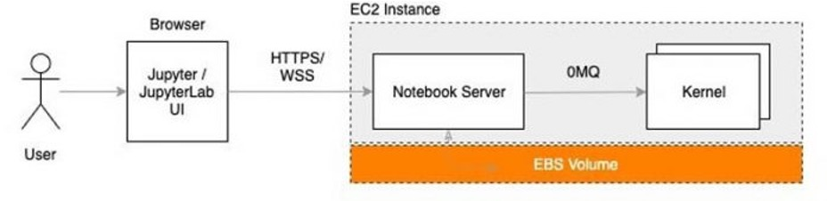
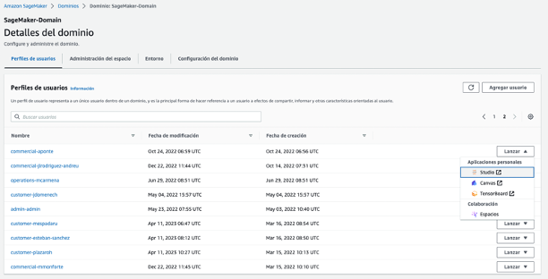
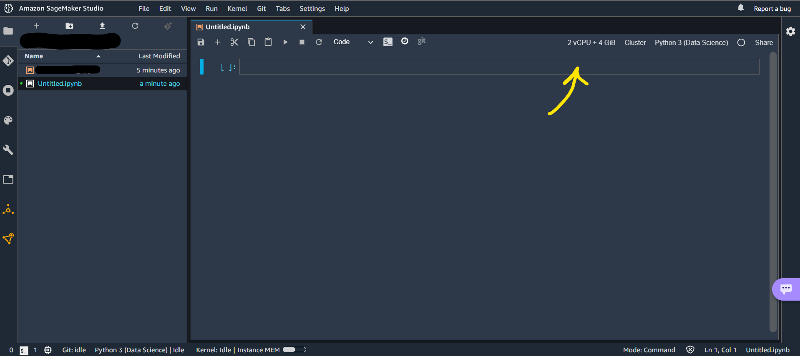
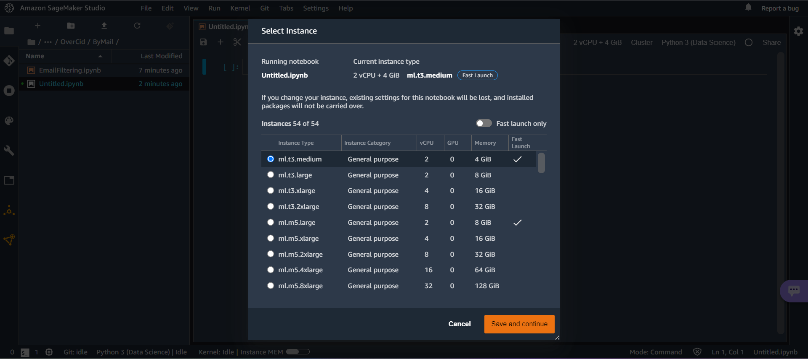

# Machine Learning Project - Sagemaker

#### Table of contents
[[_TOC_]]


## 1. Introduction

This repository has been created to help and guide the different Data teams to use AWS Sagemaker and be able to develop and deploy Machine Learning models in production in an agile and efficient way. In this guide you will find almost everything you need to know to use this service, from an overview of the framework, through the Jupyter notebook adapted to Sagemaker (with some tricks), to the Pipelines to deploy models in production.

Clarify that this template is a guide made with the purpose of helping teams, if any team wants to work in a different way, with a different project structure and with their own guidelines, they are free to do it.

## 2. Sagemaker overview

### How does it work?



Let’s first understand how Jupyter notebooks are set up and accessed. Jupyter notebooks are by default hosted on a single machine and can be accessed via any web browser. The following diagram illustrates how it works if set up on an Amazon Elastic Compute Cloud (Amazon EC2 instance).

You can access the Jupyter notebooks by opening the browser and entering the URL of the Jupyter server, which makes an HTTPS/WSS call to the machine where the Jupyter server is hosted. The machine runs a notebook server that receives the request and uses zeromq to communicate with the kernel process.

As commented before, each user has his own EBS volume to store his data, the only thing that is shared is the instance where the notebook server is located between different verticals.

### Setup



The interface prior to using Sagemaker is shown below. Here are all the users, where the name nomenclature refers to the vertical, followed by a hyphen with the user's name. Each user has its own filesystem and shares with the other users the EC2 instance explained above to launch Sagemaker Studio. If we want to launch Sagemaker Studio with our user, we simply click on Launch and then Studio. It is important not to use the Canvas or TensorBoard service as it is quite expensive.

### Framework

In the picture above you can see the main Sagemaker interface. We have marked with numbers what we think is most important on a day-to-day basis and we will describe each of the points below:


1. Filesystem in Elastic Block Storage (EBS) where all data accessible by Sagemaker instances or notebook will be stored. It is recommended to store code, small files and configuration files here. For large files it is recommended to use s3.

2. In this tab will appear the instances that are active, the apps running in these instances, the kernels and the open terminals. It is important to look at it from time to time to avoid unnecessary expenses and to use the shutdown button in case you want to delete it.

3. To clone repositories or start a new one. In general, it is recommended to work with gitlab, although other types of project repositories can be used. To clone a repository it is recommended to use the terminal and to do it by means of commands

4. This tab is used for help, extensions or themes. It is rarely used.

5. Summary of Sagemaker internal tabs in use or open.

6. To initialize a jump start, i.e. a guided machine learning project. Its use has not been investigated.

7. Summary of the different projects, clusters and other active services in Sagemaker. Above all, it will be used to monitor and check the status of the pipelines.

8. Create a new launcher

9. Create a new folder

10. Import an external file from your local server

11. Update filesystem information and view

12. Using gitlab (command line recommended)

13. To create a new instance of jupyter notebook in the directory you are in

14. To create and use a console with python3

15. Used as a terminal image of the main Sagemaker instance.

16. Used as a system terminal of the main Sagemaker instance

17. To create a .txt file

18. We have never used it, but it is used to create less ad-hoc and more guided machine learning projects, with less flexibility.

### Commands

### Terminal

### Gitlab

### Pipeline

### Filesystem

## Sagemaker Notebooks [Jupyter]

Amazon SageMaker Notebook is a cloud-integrated Jupyter notebook service designed to simplify development and code execution on Amazon SageMaker. It enables developers and data scientists to create and run Jupyter notebooks in a secure, managed environment, with access to AWS resources and processing power.

SageMaker notebooks are based on Amazon Elastic Container Service (ECS) and run on dedicated instances. SageMaker manages the underlying infrastructure, which means users can focus on code and data, rather than worrying about infrastructure configuration.

SageMaker notebooks also offer seamless integration with other SageMaker features, such as data warehousing and training and deployment services. Users can access AWS resources, such as S3, EC2 and ECR, from within the notebook, allowing them to use AWS tools and services to build and train machine learning models and create comprehensive data analytics workflows.

In short, the AWS SageMaker notebook environment is a secure, managed cloud development platform for building, running and distributing machine learning and data analytics applications.

//TODO: FOTOS, COMENTARIOS DEL LAYOUT, ETC

### Framework

### Instances

AWS SageMaker offers several main instances that can be used depending on the use case. It is important to emphasize that due to infra limitations, not all of them can be used and in case of not being able to use it, an error will be displayed. The type instances are the following:

- ml.t2.medium: This is a low-cost instance that can be used for development and testing purposes.

- ml.m4.xlarge: This is a more powerful instance that can be used for training and intensive processing tasks. We recommend this instance for running processes with Pandas and for steps in production for both in-memory processing and training. If we want more capacity or memory, we simply increase the number (i.e. ml.m8.xlarge).

- ml.p2.xlarge: This is an instance designed for GPU processing tasks, such as training deep learning models.

- ml.g4dn.xlarge: This is a GPU instance designed for graphics-intensive tasks, such as data visualization and image generation.

- ml.c5.large: An instance designed for processing-intensive tasks that require high network bandwidth, such as large-scale data transfer.

Use case recommendation for each instance:

- ml.t2.medium: Ideal for testing and code development. We recommend this instance for launching processes in pyspark, as the instance is only used to connect to the EMR cluster and does not require high capacity and memory.

- ml.m4.xlarge: Ideal for model training and intensive processing.

- ml.p2.xlarge: Ideal for deep learning model training and other GPU processing tasks.

- ml.g4dn.xlarge: Ideal for data visualization and image generation.

- ml.c5.large: Ideal for large-scale data transfer and other processing-intensive tasks requiring high network bandwidth.

These are only general recommendations. The final use of each instance will depend on the specific use case and the performance and cost requirements. The choice of the appropriate instance depends on many factors, such as the size of the model, the size of the training data, the desired speed and efficiency, among others. It is important to carefully evaluate the needs and requirements before selecting an instance for use with Amazon SageMaker.

To select a machine, you must perform the following steps



Once selected, a menu will be displayed in which you can filter the machines that have quick access. It should be noted that the access times to any machine is affordable, being only a few minutes in most cases.



To check the prices associated with each of the machines that can be selected, you can go to the following address: https://aws.amazon.com/es/sagemaker/pricing/


#### Memory/CPU based

##### Installing libraries

Installation of libraries on a SageMaker Notebook machine:

Open a terminal on the Jupyter notebook.
Use the !pip install command to install the required libraries. For example, !pip install pandas matplotlib.
Note that some libraries, such as the data analysis libraries, may require more memory and processing power than is provided by default on a SageMaker Notebook machine. In these cases, it may be necessary to increase the memory and processing power of the machine before installing the libraries.

The following problems may be encountered when attempting to install libraries on SageMaker:

Insufficient permissions: If the user does not have sufficient permissions to install libraries in the SageMaker environment, they may receive an error message indicating that they do not have permissions to install libraries.

Dependency conflicts: Libraries often depend on other libraries to function properly. If a library depends on a specific version of another library, but the currently installed version is different, a dependency conflict may occur resulting in an error when installing the library.

Internet connection problems: If the SageMaker environment does not have Internet access, it may not be able to download the required libraries during installation.

Compatibility issues: Libraries are often developed to work with specific versions of Python and other technologies. If a library is not compatible with the version of Python or technology running in the SageMaker environment, an error may occur when attempting to install the library.

Resource issues: Some libraries may require a large amount of resources to function properly. If the SageMaker environment does not have sufficient resources available, an error may occur when attempting to install the library.

These are some of the most common problems a user may encounter when trying to install libraries in SageMaker. To resolve these problems, it is important to investigate the error message, review the documentation and consult the user community.

##### Tips

#### Distributed based [EMR]

##### Installing libraries

Installing libraries on an Apache Spark cluster and on a SageMaker Notebook machine is a different process, depending on how Spark is being used.

Installing libraries on a Spark cluster:

Create a Python dependencies file, such as a requirements.txt file, containing the libraries you want to install.
Upload the dependencies file to S3 or other Spark-accessible file storage.
Start a Spark cluster on Amazon EMR, which will include an option to specify the location of the dependency file.
Once the cluster is active, you can install the libraries on the cluster by using !pip install -r and providing the location of the dependency file in S3.

Another option available to the user is the use of the command//TODO

##### SparkMagic

SparkMagic is a set of commands that allow users to run code on an Apache Spark cluster from within a Jupyter notebook. These commands are designed to facilitate the integration of Spark with Jupyter and provide a command line interface for interacting with Spark from the notebook.

With SparkMagic, users can run code in Spark from the notebook without having to leave the Jupyter interface. In addition, SparkMagic also allows users to visualize and explore the results of Spark commands on the notebook itself.

SparkMagic also provides seamless integration with other AWS tools and services, such as S3, EC2 and EMR. This means users can access data stored in S3 and process it with Spark, use EC2 to run the Spark cluster, and use EMR to manage the underlying infrastructure.

In short, SparkMagic commands provide a simple and efficient way to interact with Apache Spark from a Jupyter notebook, and also allow users to use AWS features and resources to process and analyze data in large volumes.

SparkMagic commands include the following:

%spark configure: This command allows users to configure the connection to a Spark cluster. Users can specify the cluster URL, port, user and password, among other details.

%spark: This command allows users to create a Spark session on the specified cluster using %spark configure. After creating the session, users can write and execute code in Spark directly from the notebook.

%spark info: This command displays information about the current Spark session, including the session ID, the cluster to which it is connected, and the session status.

%spark log: This command displays logs for the current Spark session. These logs can be useful for debugging errors and better understanding what is happening in the cluster.

%spark cleanup: This command closes the current Spark session and frees the resources associated with the session.

%spark add: This command allows users to add files to the current Spark session. Users can add local or remote files to the session so that they can be accessed and used by Spark.

%spark load: This command allows users to load data into Spark from a local or remote file.

%spark display: This command allows users to display the results of Spark commands on the notebook. The results are displayed in a user-friendly format, such as a table or a graph.

These are the main SparkMagic commands, and together they provide an efficient and easy way to interact with Spark from the Jupyter notebook.

##### Tips

### Plotting

In Amazon SageMaker, users can generate graphs and visualizations to explore and understand their training data and machine learning models. This can be done using different visualization tools and libraries, such as Matplotlib, Seaborn, Plotly, among others.

However, when generating charts in Amazon SageMaker, users may encounter some issues, such as:

Configuration of visualization packages: Ensuring that the packages needed to generate charts are installed and configured correctly in the Amazon SageMaker environment can be a challenge for some users.

Performance issues: Generating charts with large amounts of data can require a lot of processing resources and can cause performance issues in the Amazon SageMaker environment.

Display issues: Sometimes, generated charts may not look as expected due to formatting or configuration issues.

Therefore, it is important for users to be aware of these potential issues when generating charts in Amazon SageMaker and take steps to address them. This includes documenting and using the appropriate visualization tools and libraries, as well as optimizing processing resources and configuring the necessary packages correctly.

Depending on the tool or library you want to use, here are some examples:

Matplotlib: is an open source data visualization library that can be used to generate charts in Amazon SageMaker. You can import and use Matplotlib in an Amazon SageMaker notebook and use its functions to generate charts.

```
!pip install matplotlib
import matplotlib.pyplot as plt
import numpy as np

# We generate example data
data = [3, 4, 1, 1, 5, 2]

# Create bar chart
plt.bar(np.arange(len(data)), data)

# Show chart
plt.show()
```

This code first installs the Matplotlib package, then imports the library and creates a bar chart with example data. The plt.show() function displays the chart on the notebook.

Seaborn: is another open source data visualization library that can be used to generate charts in Amazon SageMaker. Seaborn provides an easy-to-use interface for creating complex charts using Matplotlib.

```
!pip install seaborn
import seaborn as sns
import matplotlib.pyplot as plt
import numpy as np

# We generate example data
data = np.random.rand(50, 2)

# Create scatterplot
sns.scatterplot(data[:, 0], data[:, 1])

# Show plot
plt.show()
```

This code first installs the Seaborn package, then imports the library and creates a scatterplot with sample data. The plt.show() function displays the plot on the notebook.

Plotly: is an open source interactive visualization library that can be used to generate charts in Amazon SageMaker. With Plotly, users can create interactive charts with a wide variety of features and styles.

```
!pip install plotly
import plotly.express as px
import pandas as pd

# We generate example data
data = {'Fruit': ['Apple', 'Banana', 'Cherry', 'Date'],
        'Count': [3, 4, 1, 5]}

# Create DataFrame
df = pd.DataFrame(data)

# Create bar chart
fig = px.bar(df, x='Fruit', y='Count')

# Show graph
fig.show()
```

This code first installs the Plotly package, then imports the library and creates a bar chart with example data in a Pandas DataFrame. The fig.show() function displays the chart in the notebook.

To use any of these tools or libraries, users must first install and configure the necessary packages in their Amazon SageMaker environment. Then, they can import the library into their notebook and use its functions to generate charts.

It is important to note that chart generation can require a lot of processing resources and can cause performance issues in the Amazon SageMaker environment, so it is important to optimize resources and properly configure the necessary packages.

### boto3 [s3]

Boto3 is a software library developed by Amazon Web Services (AWS) that provides an application programming interface (API) for interacting with different AWS services. Boto3 makes it easy to work with AWS services from Python.

In Sagemaker, Boto3 is used to manage and automate tasks related to the creation and use of machine learning models. For example, Boto3 can be used to create and manage Sagemaker resources, such as training and production instances, and to send and receive data to and from Sagemaker.

Boto3 is built on top of a library called Botocore, which it shares with AWS CLI. Botocore provides the low-level client, session, and credential and configuration data. Boto 3 builds on Botocore by providing its own session, resources, and collections.

Modules generally fall into two categories, those that include a high-level object-oriented interface and those that include only a low-level interface that matches the Amazon Web Services API (These interfaces are resources and clients respectively. a look at both shortly).
Some modules are completely high-level (such as Amazon S3 or EC2), some include high-level code over a low-level connection (such as Amazon DynamoDB), and some are 100% low-level (such as Amazon Elastic Transcoder).
Clients: are low-level service connections with the following main characteristics:

Supports all services.
Outputs are returned using Python dictionaries.
We have to traverse these dictionaries ourselves
Automatic pagination of responses (Paginators)
A way to block until a certain state has been reached (Waiters)

Along with these core features, Boto 3 also provides sessions and per-session credentials and configuration, as well as basic components such as authentication, parameter and response handling, an event system for customizations, and logic for retrying failed requests.

Some code examples of using Boto3 with Sagemaker are described below:

Read files present with pandas from S3:
```
import boto3

s3 = boto3.client('s3')

response = s3.list_objects(
    Bucket='my-bucket',
    Prefix='path/to/my/files/'
)

files = [content['Key'] for content in response.get('Contents', [])]

print(files)
```

Create a Sagemaker trainer:

```
import boto3

sagemaker = boto3.client('sagemaker')

training_image = '012345678910.dkr.ecr.us-west-2.amazonaws.com/image-classification:latest'
role = 'arn:aws:iam::012345678910:role/service-role/AmazonSageMaker-ExecutionRole-20181129T121160'

response = sagemaker.create_training_job(
    TrainingJobName='my-training-job',
    AlgorithmSpecification={
        'TrainingImage': training_image,
        'TrainingInputMode': 'File'
    },
    RoleArn=role,
    InputDataConfig=[
        {
            'ChannelName': 'train',
            'DataSource': {
                'S3DataSource': {
                    'S3DataType': 'S3Prefix',
                    'S3Uri': 's3://my-bucket/train',
                    { 'S3DataDistributionType': 'FullyReplicated'.
                }
            },
            'ContentType': 'application/x-record',
            'CompressionType': 'None'
        }
    ],
    OutputDataConfig={
        'S3OutputPath': 's3://my-bucket/output'
    },
    ResourceConfig={
        'InstanceType': 'ml.c4.xlarge',
        'InstanceCount': 1,
        'VolumeSizeInGB': 50
    },
    StoppingCondition={
        'MaxRuntimeInSeconds': 3600
    },
    HyperParameters={
        'image_shape': '3,224,224',
        'num_classes': '2',
        'num_training_samples': '15420',
        'mini_batch_size': '10',
        'epochs': '10',
        'learning_rate': '0.01'
    }
)

```
Create a Sagemaker endpoint:

```
import boto3

sagemaker = boto3.client('sagemaker')

response = sagemaker.create_endpoint(
    EndpointName='my-endpoint',
    EndpointConfigName='my-endpoint-config', EndpointConfigName='my-endpoint-config'.
)

print(response)
```
In this example, an endpoint with the name my-endpoint is created and associated with a previously created endpoint configuration named my-endpoint-config. The API response will include information about the created endpoint, such as the ID and the current status.

Note: Before creating an endpoint, you must first create an endpoint configuration that specifies details about how the model will be used in production.


## Production

### Project structure

#### Exploratory data analysis (EDA)

#### Develop

#### Production

### Continuous integration with GitLab

### Sagemaker Pipeline (framework and tips)

### Foto grafo + explicación de cada step y su código

# Utils for mkdocs

```
introduce code
```