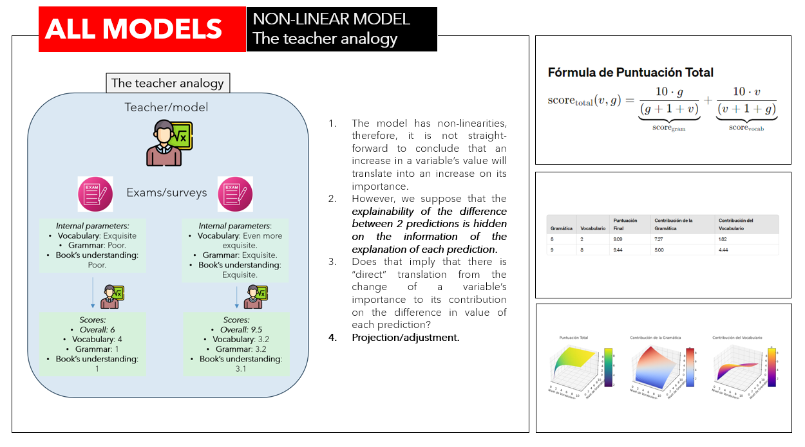

# AI Explanatory Drivers - VS Past Pipeline
The VS Past Pipeline is part of the broader AI Explanatory Drivers tool.

## Methodology

The AI Explanatory Drivers tool explains the NPS, which is computed as the difference in probabilities of being a promoter and being a detractor within a sample of clients, based on their response to a generic satisfaction question (nps_100).

The pipeline contains two binary classifier models, both operating on a client level:
- One model outputs the probability of being a promoter.
- The other model outputs the probability of being a detractor given a certain survey, excluding the generic question.

These probabilities are used to compute the NPS per client as their difference in probabilities. The NPS of a sample of clients is then predicted as the mean client NPS within the sample.

The key feature of this procedure is computing the NPS without relying on the generic question of the survey. Instead, it uses the rest of the questions and some external variables to provide insights into what has driven changes in the NPS over different periods of time, hence the name AI Explanatory Drivers.

This part of the tool is named the "VS Past" pipeline because it operates on a client level, requiring the exact population that generated a certain NPS, which is only accessible for past periods of time.

## Explainability with Shapley Values

The tool uses Shapley values to explain each prediction for both models. The Shapley values output values in the logistic space, so an inv_logistic transformation is applied to convert them into the probabilistic space. Although this is not mathematically exact, it is the standard procedure in the industry.

For each client, the difference in base values for both models is taken as the "base NPS value," and the difference in Shapley values per variable is associated with an "NPS Shap value." The logic is simple, and since the operations are linear, it can be considered correct.

To compute the explainability of the NPS for a sample of clients, the NPS base value is taken and each NPS Shap value is averaged separately.

## Explanation of difference as a difference in explanations.

The end goal of the tool is to compare and explain why there is a difference in NPS between two periods of time (or two samples of clients). The main assumption is that this explanation is somehow hidden in the difference (not in a mathematical sense) in NPS explanations for each period of time. For now, the mathematical difference is taken as a proxy to extract this information.

After computing the NPS and its explainability with the above procedure for two periods of time, the result of subtracting the Shapley values separately is taken as the explanation of why the NPS changed. Notice that because the models remain the same, when the base values of both samples are subtracted, they cancel out.

One thing that is quickly noticeable using this approach is how, due to both the non-linear nature of the model and the uncertainty in the explanations, there are sometimes variables that have a positive change and are known to have a positive impact but are counterintuitively translated into negative Shapley values.

## Uncertainty: MAE and Flipped Shaps

There are two main indicators that can trigger alarms in the procedure. The first is how close the NPS prediction is to the actual NPS. The second is the occurrence of flipped Shapley values. Before exploring solutions, it is essential to understand the tool, the sources of uncertainty within it, and how they may affect both the MAE and the nature of the Shapley values.

The tool comprises three layers:
1. The Predictions Layer.
2. The Explainability Layer.
3. The Aggregation Layer.

### 1. Predictions Layer
In this layer, key questions include:
- Is the NPS driven by the variables?
- Are the models “statistically good” enough (whatever that may mean in this use case)?

If the NPS for a certain period is driven by variables not accounted for, it is understandable that both the MAE and the explanations could be significantly off. Additionally, if the models do not have good classification metrics, the outputted logistic values will be inaccurate.

### 2. Explainability Layer
This layer depends on Shapley values and includes questions such as:
- Are the variables independent enough for SHAP?
- Are the Shapley values being transformed too roughly into the probabilistic space?

The first question is addressed by using models and explainers robust to independence, although some studies question this assumption. For the second question, as previously mentioned, an approximation is used when transforming the logistic values outputted by SHAP into the probabilistic space.

### 3. Aggregation Layer
In this layer, considerations include:
- Is the mean user representative of the sample? If not, why? Is it due to issues in the Predictions or Explainability layers, or is it a natural occurrence?
- Is the satisfaction (as represented in the dashboard) representative of the sample?

Since variables that define a sample of clients are represented, there is statistical uncertainty that depends on the sample itself.

All three layers contribute to the final prediction uncertainty and error, resulting in larger MAEs and less precise Shapley values, which can lead to the flipping of these values. 

BUT, even if all factors were perfect, the non-linear nature of the model still needs to be addressed, as it could also cause the flipping of Shapley values (though not the MAE).

## Adjustments

## Uncertainty propagation

